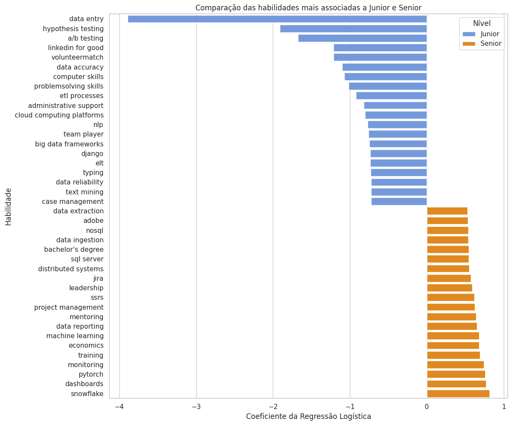
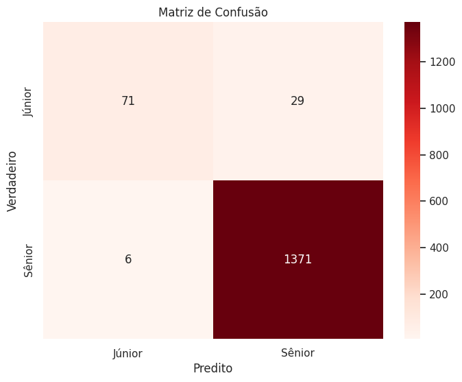

# Classificador de Senioridade em Vagas de Data Science


##  Visão Geral do Projeto

##  Problema de Negócio
O mercado de trabalho em Tecnologia e Data Science sofre com a **subjetividade** na definição de níveis hierárquicos. Vagas de "Júnior" frequentemente exigem *stacks* de "Sênior", gerando ineficiência no recrutamento e frustração em candidatos.

##  Solução Proposta
Este projeto utiliza Machine Learning (Regressão Logística) e Processamento de Linguagem Natural (NLP) para:
1.  Classificar automaticamente vagas como Júnior ou Sênior.
2.  **Quantificar** o peso de cada habilidade técnica na definição da senioridade (interpretabilidade do modelo).

##  Resultados e Performance

O modelo de Regressão Logística obteve uma **Acurácia Global de [97.6%]** no conjunto de teste, demonstrando alta capacidade preditiva.

###  Interpretabilidade: O Peso das Habilidades

A principal entrega do projeto é a **interpretabilidade**. A análise dos coeficientes revela quais habilidades movem o *log-odds* de uma vaga ser Sênior.



* **Preditores de Senioridade:** Habilidades ligadas à arquitetura, orquestração e ferramentas de alto nível (ex: `Snowflake`, `PyTorch`, `Leadership`).
* **Indicadores de Nível Inicial:** Habilidades de execução e tarefas operacionais (ex: `Data Entry`, `Typing`, `Assist`).

### Matriz de Confusão

A matriz visualiza os acertos e erros, confirmando a alta taxa de Verdadeiros Positivos (Sênior classificado como Sênior).


## 🛠️ Tecnologias e Dependências
O projeto foi desenvolvido em Python e requer as seguintes bibliotecas:

* **pandas**

* **numpy**

* **scikit-learn**

* **seaborn**

* **matplotlib**

Para instalar todas as dependências:
```bash
pip install -r requirements.txt